# Songarr

**Your family's own music streaming service. Bring your Spotify library over in one file.**

<p align="center">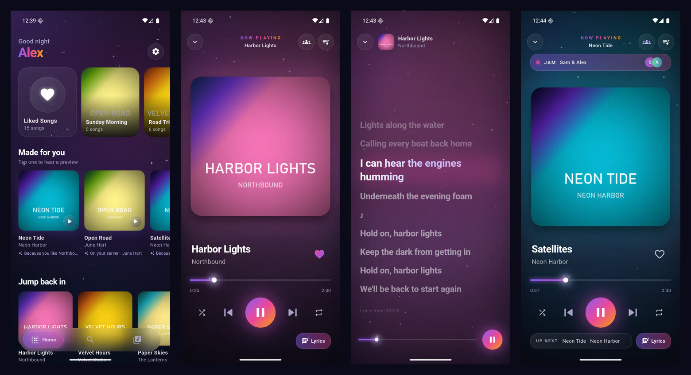</p>

Songarr is like Sonarr and Radarr, but for songs. Each person brings their Spotify **Liked Songs and
playlists** over once with [Exportify](https://exportify.app), then likes, adds and requests songs in
the app. Songarr finds each song on YouTube Music, downloads the audio with
[yt-dlp](https://github.com/yt-dlp/yt-dlp), tags it with its details and cover art, and files it in a
tidy music library on your own computer. Then its **Android app** streams that
library to your family's phones, with offline downloads, recommendations, podcasts, lyrics and
"Jams" for listening together.

> **Please read [Legal and fair use](#legal-and-fair-use) before you use Songarr.**
> All screenshots in this guide use made-up demo music and example accounts.

---

## Contents

- [What you get](#what-you-get)
- [How it fits together](#how-it-fits-together)
- [Setup checklist](#setup-checklist)
- [Step 1: Install the server](#step-1-install-the-server)
- [Step 2: Bring your music over](#step-2-bring-your-music-over)
- [Step 3: A web address for your phones](#step-3-a-web-address-for-your-phones)
- [Step 4: Build and install the Android app](#step-4-build-and-install-the-android-app)
- [Step 5: Sign in on each phone](#step-5-sign-in-on-each-phone)
- [Optional extras](#optional-extras): Jam notifications (Firebase), Wikipedia, Last.fm, YouTube sign-in, family members, start at logon
- [Using Songarr](#using-songarr)
- [Keeping it working](#keeping-it-working) · [Backup servers](#backup-servers): a second server that takes over by itself
- [Settings reference](#settings-reference) · [Where things live](#where-things-live) · [Security and privacy](#security-and-privacy)
- [Troubleshooting](#troubleshooting) · [Development](#development) · [Legal and fair use](#legal-and-fair-use)

---

## What you get

**The server** (Python, runs on your PC):

- Brings each family member's Spotify Liked Songs and playlists over from one
  [Exportify](https://exportify.app) file. After that, people like, add and request songs in the app.
- Picks the official audio on YouTube Music for each song, checked against the song's title,
  artists and length, so covers, live versions and music-video intros don't sneak in.
- Downloads in parallel, **paced to stay under YouTube's limits**, with automatic backoff.
- Tags files (title, artists, album, track, year, ISRC, cover art) and writes `.m3u8` playlists
  that Plex, Jellyfin, foobar2000 and VLC can open.
- An **admin website** (only on your PC) to watch progress, fix uncertain matches, manage family
  profiles and settings, and delete files.

<p align="center">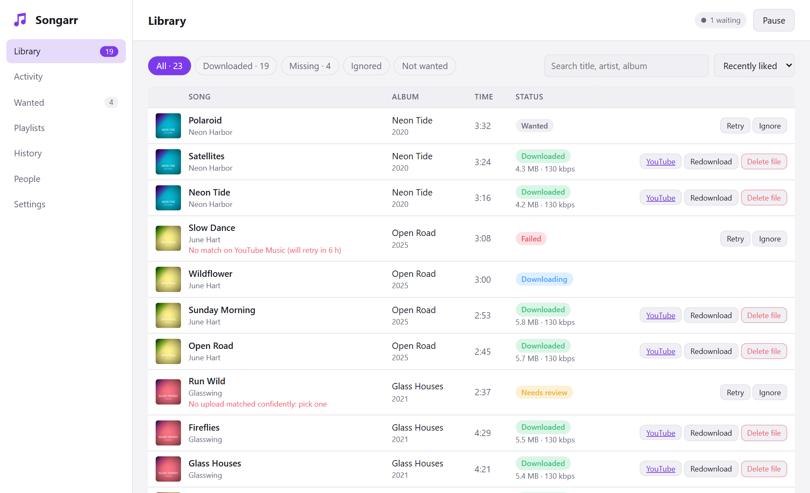</p>

**The app** (Flutter, Android):

| | | |
| :---: | :---: | :---: |
| 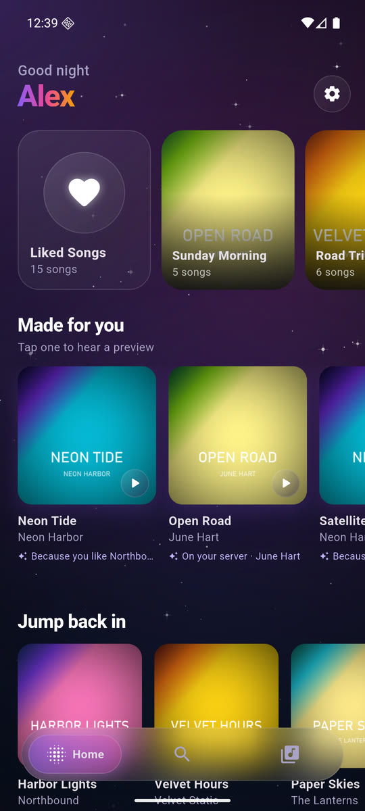<br>**Home**, made for each person | 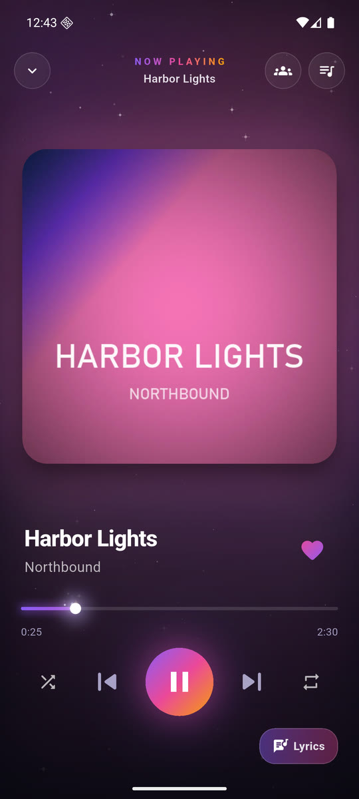<br>**Now Playing** | 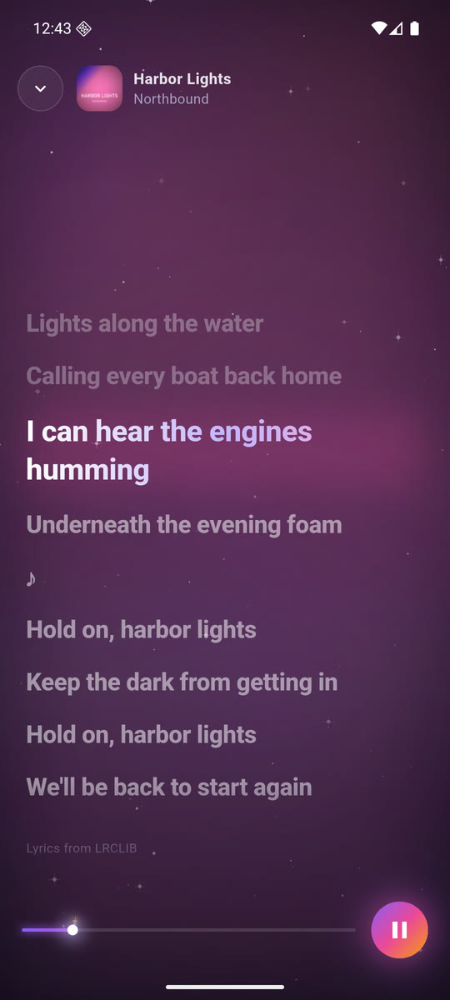<br>**Synced lyrics** |
| 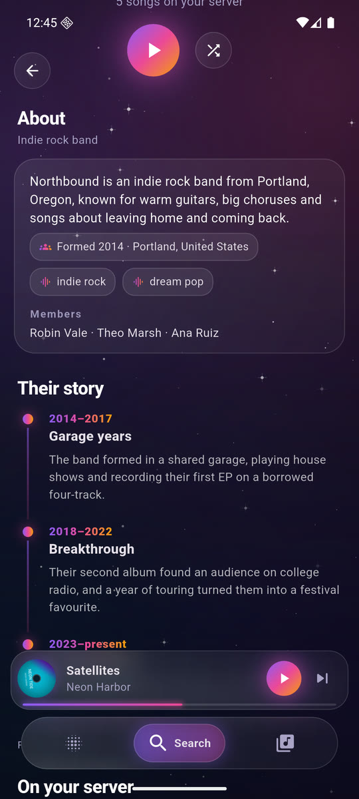<br>**Artist bios and history** | 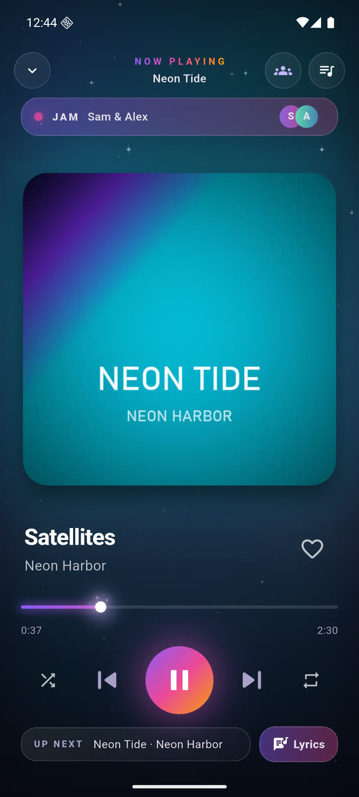<br>**Jams**: listen together | 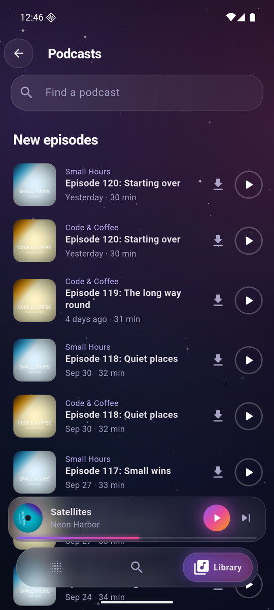<br>**Podcasts** |

- Sign in with a QR code from the admin website, or with a name and password.
- **Made-for-you** songs, artists and podcasts, with 30-second previews; **Like** downloads a song.
- Liked Songs and playlists that are **yours to edit**: rename, reorder, add, remove.
- Background playback with notification, lock-screen, Bluetooth and headphone controls.
- **Offline downloads** and a smart listening cache. Self-updates from your own server.
- A starry nebula look with a gyroscope **depth effect**.

## How it fits together

```
 Exportify file (each person's Spotify likes and playlists, once)
        │  imported on People
        ▼
 ┌──────────────── your PC ────────────────┐       YouTube Music
 │  Songarr server                         │◀────── (audio, paced)
 │   • admin website   127.0.0.1:8484      │
 │   • app API         127.0.0.1:8486  ◀───┼──┐
 │   • music library   (any folder / NAS)  │  │
 └─────────────────────────────────────────┘  │
                                              │ HTTPS through Cloudflare Tunnel (or Tailscale)
                                  Songarr app on phones
```

- **Port 8484, the admin website.** Only ever on `127.0.0.1`. **Never expose it.**
- **Port 8486, the app API.** JSON and audio (plus the app's download page), and every request needs
  a device token. This is the only thing phones use, through an HTTPS tunnel. Its contract is in
  [docs/API.md](docs/API.md).

---

## Setup checklist

| Step | What you do | Time | Cost |
| --- | --- | --- | --- |
| [1](#step-1-install-the-server) | Install Python, FFmpeg, Node.js and Songarr on the PC | 15 min | Free |
| [2](#step-2-bring-your-music-over) | Each person exports their Spotify library with Exportify; you import it | 5 min each | Free |
| [3](#step-3-a-web-address-for-your-phones) | Buy a domain and set up a Cloudflare Tunnel (or use Tailscale) | 20 min | Domain ≈ $10/year; tunnel free |
| [4](#step-4-build-and-install-the-android-app) | Install Flutter, build the app, install it on the phones | 45 min, first time | Free |
| [5](#step-5-sign-in-on-each-phone) | Scan a QR code on each phone | 1 min each | Free |
| [Extras](#optional-extras) | Notifications, better artist bios, YouTube sign-in | 5–15 min each | Free |

You need a **Windows PC that stays on** (Songarr is plain Python and should run on Linux or
macOS too, but this guide uses Windows; Ubuntu and Debian have an install script, see
[Backup servers](#backup-servers)), and about **4 MB of disk per song** (1,500 songs ≈ 6 GB).

---

## Step 1: Install the server

> **Easiest: the installer.** Run `Songarr-Setup-<version>.exe` (from the [Releases page](https://github.com/ApexusNULL/Songarr/releases) when there is one, or [build it](#building-the-installer)). It brings its own Python, asks for a name and logo, your music folder and the ports, makes the shortcuts, and can install FFmpeg and Deno; then carry on with [Step 2](#step-2-bring-your-music-over). The steps below install from source instead (needed to build the phone app in Step 4 anyway).
>
> <p align="center">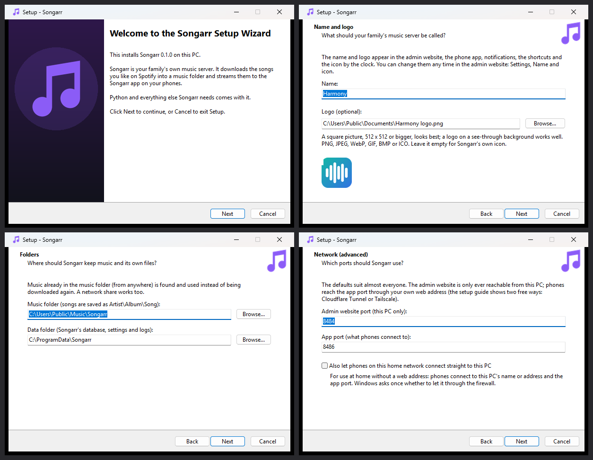</p>

**1. Install the tools.** Open **PowerShell** (Start menu → type *PowerShell*) and run the
commands below. [winget](https://learn.microsoft.com/windows/package-manager/winget/) is built
into Windows 10 and 11.

<p align="center">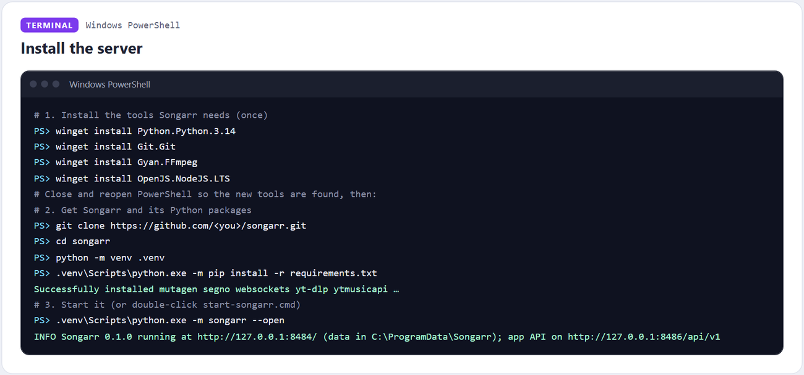</p>

```powershell
winget install Python.Python.3.14
winget install Git.Git
winget install Gyan.FFmpeg
winget install OpenJS.NodeJS.LTS
```

- **Python** runs Songarr (3.12 or newer).
- **FFmpeg** processes the audio.
- **Node.js** is needed by yt-dlp to read YouTube (Deno also works).
- **Git** downloads Songarr.

**Close PowerShell and open it again** so it finds the new tools.

**2. Download Songarr and install its Python packages:**

```powershell
git clone https://github.com/ApexusNULL/Songarr.git songarr
cd songarr
python -m venv .venv
.venv\Scripts\python.exe -m pip install -r requirements.txt
```

**3. Start it.** Make a desktop shortcut (with Songarr's icon) once:

```powershell
.venv\Scripts\python.exe -m songarr --shortcut
```

Double-click **Songarr** on your desktop (or **`start-songarr.cmd`** in the Songarr folder). Songarr
runs in the background (no window) and opens the admin website at **http://127.0.0.1:8484** in your
browser. When it's already running, the shortcut just opens the website.

<p align="center">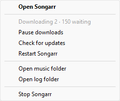</p>

While it runs, Songarr has an icon by the clock (Windows puts new icons under **Show hidden
icons** ^; drag it onto the taskbar to keep it in view). Hover over it to see what Songarr is doing,
and click it for:

- **Open Songarr**: the admin website.
- **Pause downloads** / **Resume downloads**.
- **Check for updates**: installs new yt-dlp releases straight away ([Keeping it working](#keeping-it-working)).
- **Restart Songarr** (**Restart to finish updating** after an update).
- **Open music folder** and **Open log folder**.
- **Stop Songarr** (asks first: phones can't play until it's started again).

> Prefer to watch the log? Run `.venv\Scripts\python.exe -m songarr --open` instead.
> Options: `--data <folder>` (database and logs; default `%PROGRAMDATA%\Songarr`), `--port`
> (admin website, default 8484), `--app-port` (app API, default 8486) and `--no-tray` (no icon by
> the clock). Options given with `--shortcut` are put into the shortcut.

**4. Choose your music folder.** In the admin website open **Settings → Downloads → Library
folder**. Any folder works, including a network share like `\\nas\music`. Songs are saved as
`Artist\Album (Year)\NN - Title.m4a`. Music already in the folder (from anywhere) is found and used
instead of being downloaded again; see [Music you already have](#music-you-already-have).

<p align="center">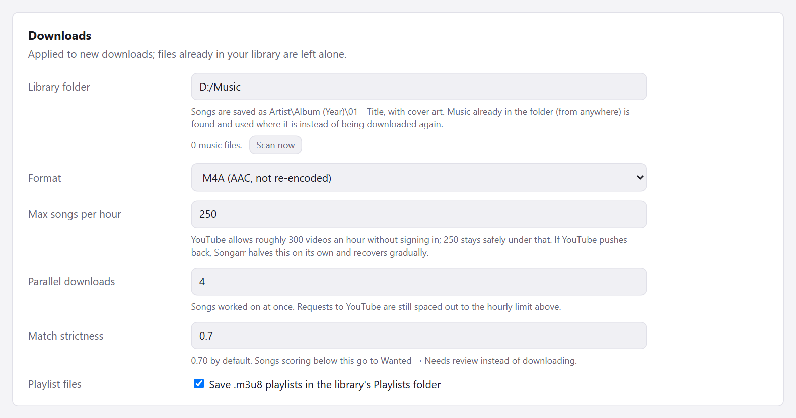</p>

---

## Step 2: Bring your music over

Songarr doesn't connect to Spotify. Each person brings their Spotify library over once, with
[Exportify](https://exportify.app), a free website that reads their Spotify through its own app:

1. They open [exportify.app](https://exportify.app), sign in with Spotify, and click **Export All**
   (a .zip of every playlist plus Liked Songs), or **Export** next to just one (a .csv).
2. They send you the file. In Songarr → **People**, click **Import from Exportify…** on their
   profile and choose it. (Add a profile for each person first: [Family members](#family-members).)

<p align="center">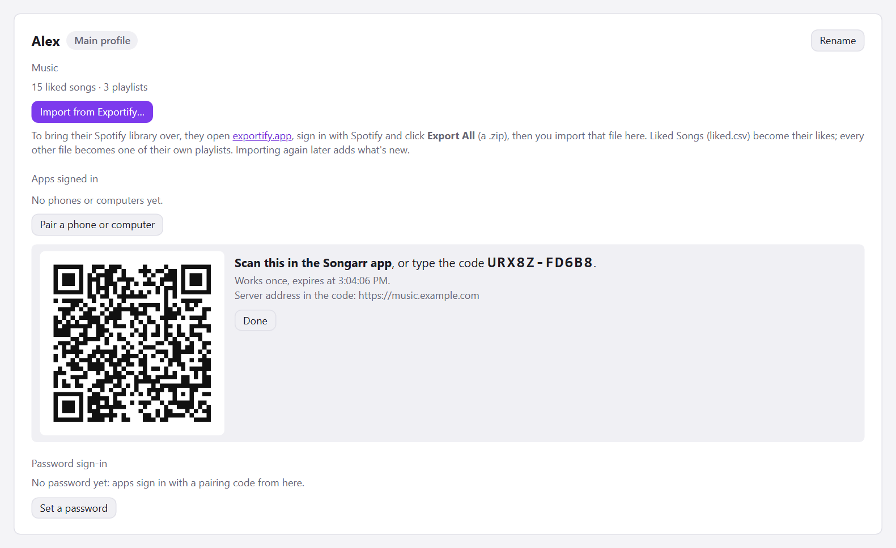</p>

Liked Songs (Exportify's `liked.csv`) become their likes, in the order they liked them on Spotify;
every other file becomes one of their own playlists. Songs already on the server are used as they
are, and the rest download. Importing a newer export later brings in what's new without doubling
anything (a playlist that's already there by that name is skipped). Export with Exportify set to
English (Songarr reads its English column names). After that, everything happens in Songarr: people
like, add and request songs in the app.

Within a few minutes the **Library** page fills up and downloads begin. A big library (1,000+ songs)
takes several hours to download, because Songarr deliberately goes slowly enough that YouTube
doesn't block it. Leave it running overnight.

---

## Step 3: A web address for your phones

Your phones need a secure (HTTPS) address that reaches **port 8486** on your PC, from home or
anywhere. Two options; neither opens a port on your router.

| | Cloudflare Tunnel (recommended) | Tailscale |
| --- | --- | --- |
| Works on | Any phone, anywhere, nothing to install on it | Only devices with the Tailscale app |
| Needs | A domain name (≈ $10/year) and a free Cloudflare account | A free Tailscale account |
| Privacy | Cloudflare decrypts traffic at its edge | End-to-end encrypted |

### Option A: your own domain with Cloudflare Tunnel

**1. Get a domain.** A domain is your own address on the internet, like `example.com`. The
easiest place to buy one for this is **Cloudflare Registrar**: it sells domains at cost price
(about $10–$15 a year for `.com`) and they're ready for a tunnel straight away.

<p align="center">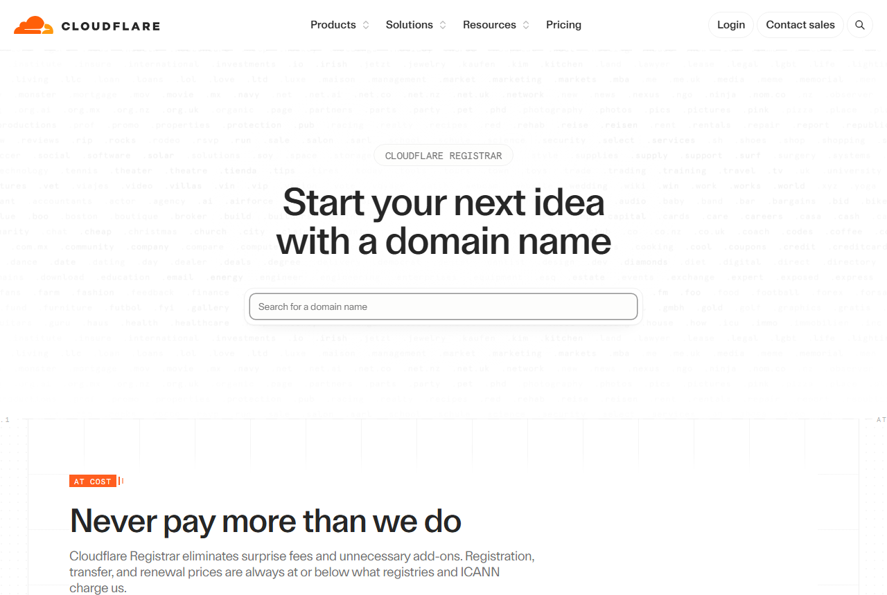<br>
<sub><a href="https://www.cloudflare.com/products/registrar/">cloudflare.com/products/registrar</a></sub></p>

<p align="center">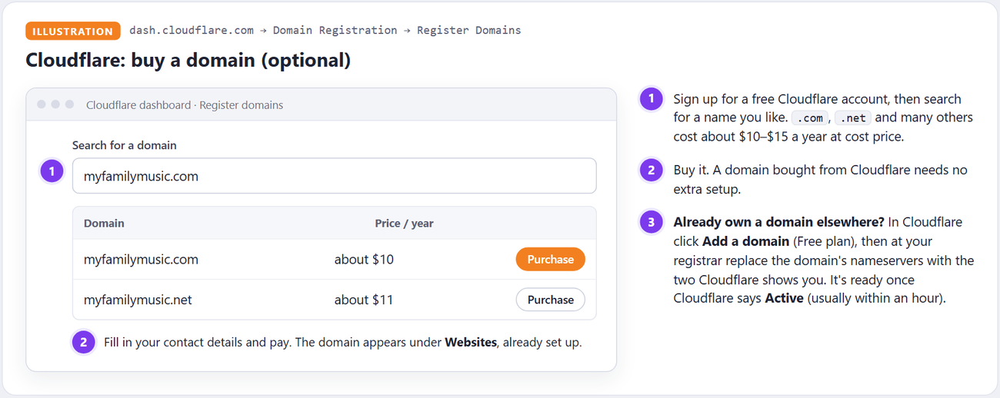</p>

> **Already have a domain somewhere else** (GoDaddy, Namecheap, Google/Squarespace, Porkbun…)?
> You don't need to move it. In the Cloudflare dashboard click **Add a domain**, choose the
> **Free** plan, and Cloudflare shows you two *nameservers*. At your current registrar, replace
> the domain's nameservers with those two. When Cloudflare shows the domain as **Active** (often
> within an hour, at most a day), carry on.

**2. Create the tunnel.** The tunnel is a small Windows service (`cloudflared`) that connects your
PC out to Cloudflare, so nothing on your router changes. First install it:

```powershell
winget install --id Cloudflare.cloudflared -e
```

Then follow Cloudflare's guide, [Create a tunnel (dashboard)](https://developers.cloudflare.com/cloudflare-one/connections/connect-networks/get-started/create-remote-tunnel/):

<p align="center">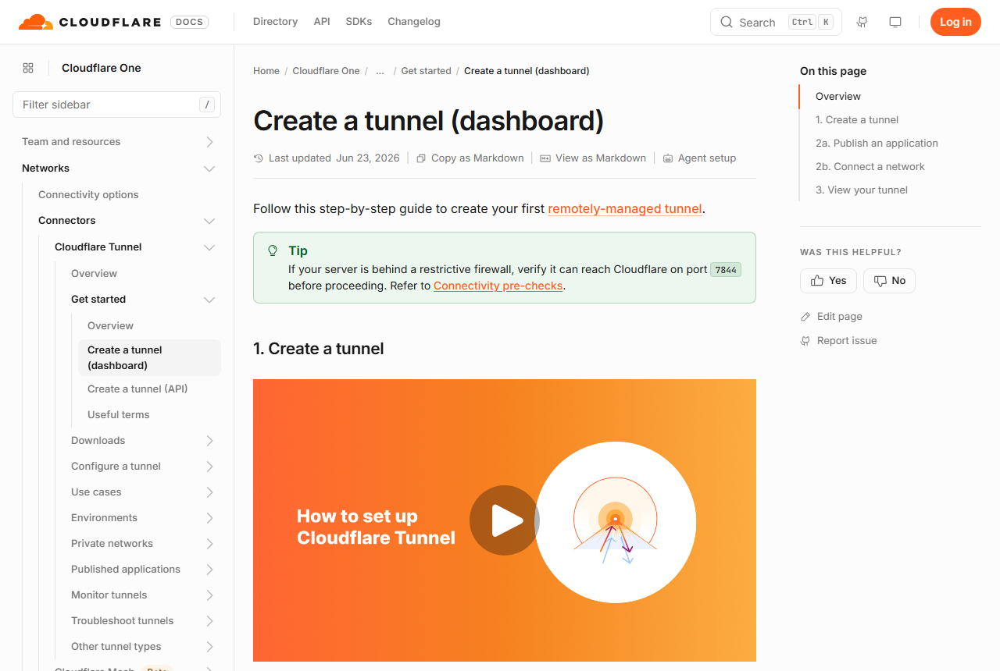</p>

<p align="center">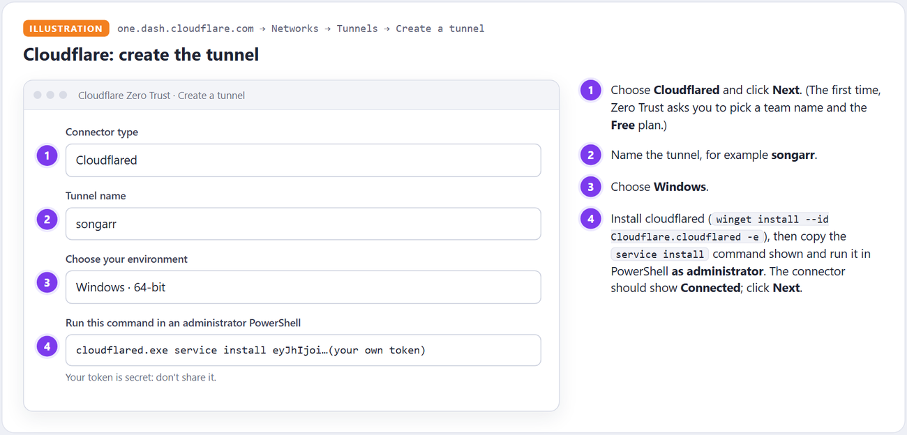</p>

**3. Point your address at Songarr.** On the next screen, add a **public hostname** for the
tunnel, for example `music.example.com` → **HTTP** `localhost:8486`:

<p align="center">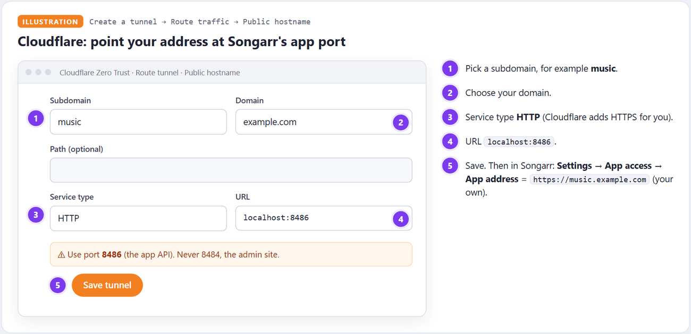</p>

**4. Tell Songarr its address.** In the admin website: **Settings → App access → App address** =
`https://music.example.com` (your own). Pairing QR codes then carry this address.

<p align="center">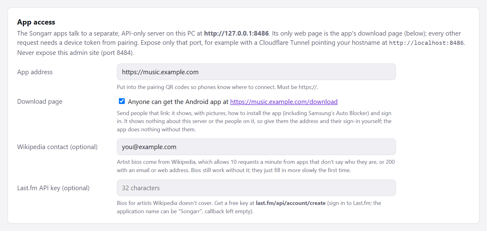</p>

**Check it:** open `https://music.example.com` in a browser. You should see a plain **404**
error. That's correct: the only page is the app's download page at `/download`, and everything else
needs a device token. If the page
doesn't load at all, see [Troubleshooting](#troubleshooting).

### Option B: Tailscale (no domain needed)

Install [Tailscale](https://tailscale.com/download) on the PC and on every phone, and sign in to
the same account on all of them. On the PC run:

```powershell
tailscale serve --bg 8486
```

The first time, it may ask you to enable HTTPS for your tailnet: open the link it prints and
click **Enable**, then run the command again. It prints an address like
`https://your-pc.tail1234.ts.net`. Put that into **Settings → App access → App address**. See
[Tailscale Serve](https://tailscale.com/kb/1312/serve) for details.

---

## Step 4: Build and install the Android app

The app is built from source on your PC. The first time takes a while because Flutter downloads
the Android tools.

**1. Install Flutter and Android Studio.** Follow Flutter's
[Windows install guide for Android](https://docs.flutter.dev/get-started/install/windows/mobile)
(it installs **Android Studio**, which brings the Android SDK and Java). When `flutter doctor`
shows a ✓ for *Flutter* and *Android toolchain*, you're ready.

**2. (Optional) Turn on Jam notifications** by setting up Firebase *before* you build; see
[Jam notifications](#jam-notifications-firebase). You can also do it later and rebuild.

**3. Build:**

<p align="center">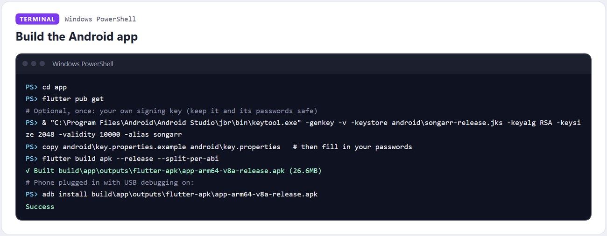</p>

```powershell
cd app
flutter pub get
flutter build apk --release --split-per-abi
```

This makes one app file per phone type in `app\build\app\outputs\flutter-apk\`. Almost every
phone made since 2017 needs **`app-arm64-v8a-release.apk`**.

> **Recommended: sign it with your own key.** Android only installs an *update* signed with the
> same key as the installed app. Create a key once, before your first build (shown in the terminal
> above), then copy `android\key.properties.example` to `android\key.properties` and fill in the
> passwords you chose. **Back up the `.jks` file and passwords**: without them, phones must
> uninstall and reinstall to update. Both files are ignored by git. Without a key, Flutter's
> debug key is used.

**4. Install it on each phone:**

- **Easiest:** publish it (5, below), then send people your app address followed by `/download`
  ([the download page](#the-download-page)): it walks them through installing it, with pictures.
- **Or** copy the `.apk` to the phone (USB, Google Drive, email…), tap it, and allow
  *install unknown apps* when Android asks.
- **Or**, phone plugged in with USB debugging on: `adb install app-arm64-v8a-release.apk`

The first time the app opens it asks to **show notifications**. Allow it: that's what shows the
media controls and lock-screen player.

**5. Later updates are automatic.** When you change the app, bump `version:` in
`app/pubspec.yaml` (the number after `+` must go up), build, then publish it from the server:

```powershell
cd ..
.venv\Scripts\python.exe -m songarr.app_updates publish --notes "What's new"
```

Phones check when the app opens, download the update and offer **Install**. After the app has
updated itself once, Android installs later updates without asking.

---

### The download page

Send people **your app address followed by `/download`** (for example
`https://music.yourdomain.com/download`). It offers the newest app you've published, with a picture
of every install step: opening the download, allowing installs from that source, Samsung's **Auto
Blocker**, Play Protect's warning, the camera prompt and the sign-in screen.

The page says nothing about your server or the people on it, not even its address: you give them
the address and their sign-in (a pairing code or a password) yourself, and the app does nothing
without them. Search engines are asked not to list it. **Settings → App access → Download page**
switches it off; then `/download` answers an empty 404 like every other address.

## Step 5: Sign in on each phone

In the admin website open **People**, choose the person, and click **Pair a phone or computer**.
In the app, scan the QR code (or tap **Type a pairing code**). Codes work once and expire after
10 minutes.

<p align="center"></p>

| | |
| :---: | --- |
| 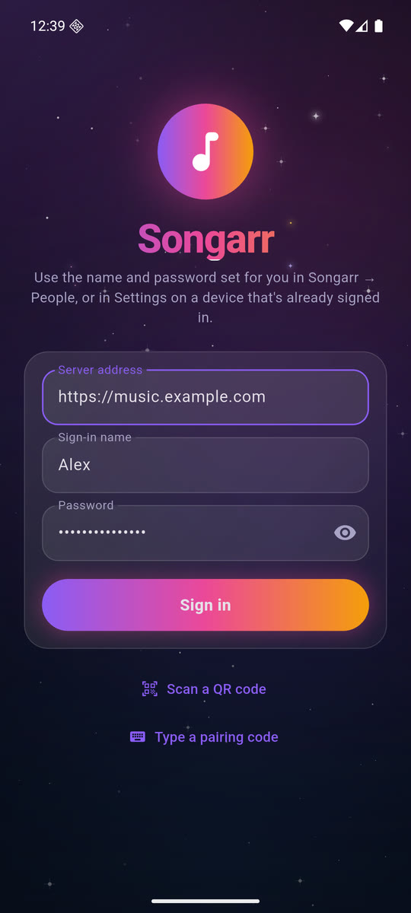 | **Prefer a password?** Give the person a sign-in name and password under **People → Set a password** (or set your own in the app: **Settings → Signing in**). On a new device choose **Sign in with a password** and enter the app address from Step 3, the name and the password.<br><br>Signed-in devices are listed under each person and can be signed out at any time. |

---

## Optional extras

### Jam notifications (Firebase)

Jam invites always appear while the app is open. To also get them as **notifications when the
app is closed**, connect the free Firebase Cloud Messaging service. You need a Google account.

<p align="center">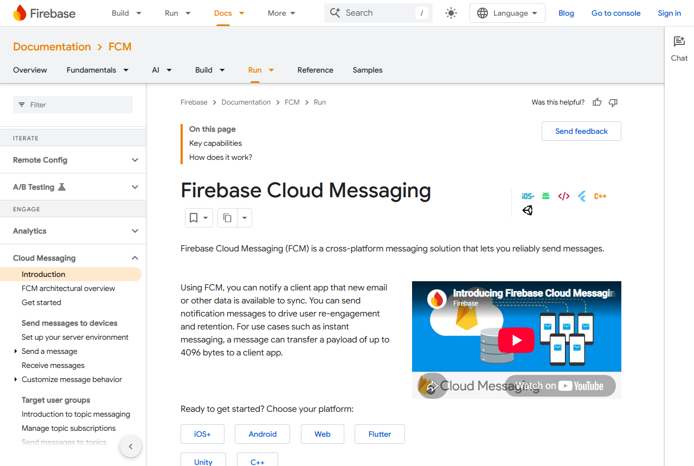<br>
<sub><a href="https://firebase.google.com/docs/cloud-messaging">firebase.google.com/docs/cloud-messaging</a></sub></p>

**1.** At [console.firebase.google.com](https://console.firebase.google.com) click **Create a
project** (any name; Google Analytics can be turned off). Then add an **Android** app:

<p align="center">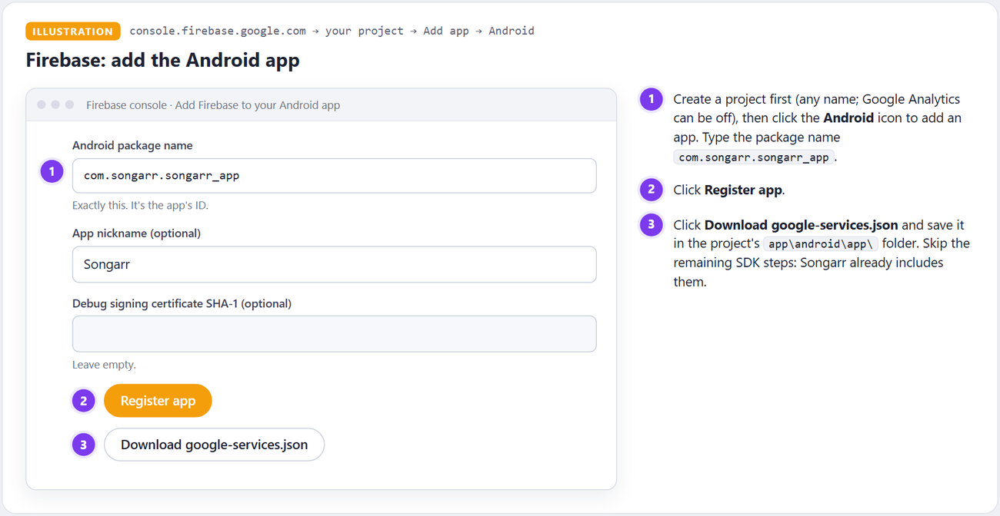</p>

**2.** Create the key the server uses to send notifications:

<p align="center">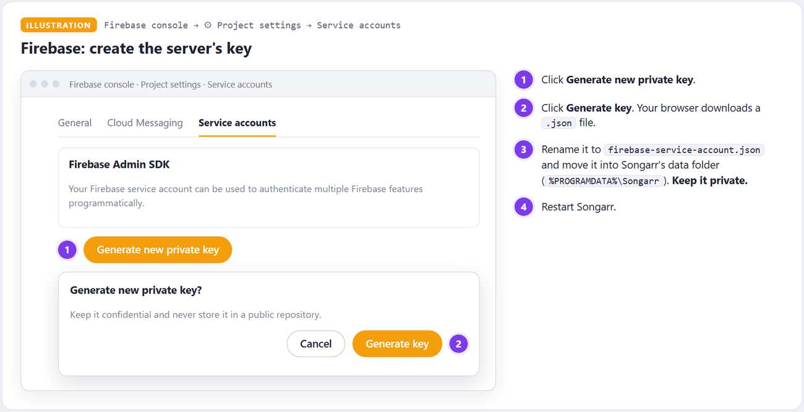</p>

**3.** Check messaging is switched on:

<p align="center">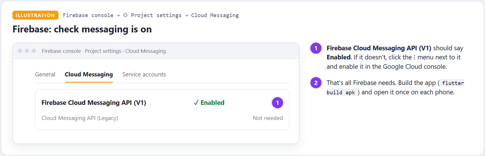</p>

**4.** Restart Songarr, build the app ([Step 4](#step-4-build-and-install-the-android-app)) and
install it. Each phone registers for notifications the first time it opens the app.

| | | |
| :---: | :---: | :---: |
| 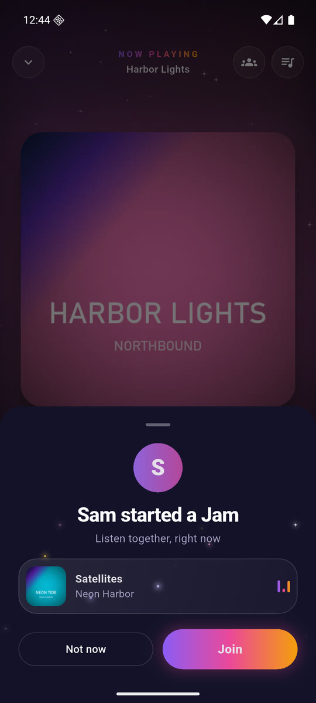<br>An invite | <br>In a Jam | 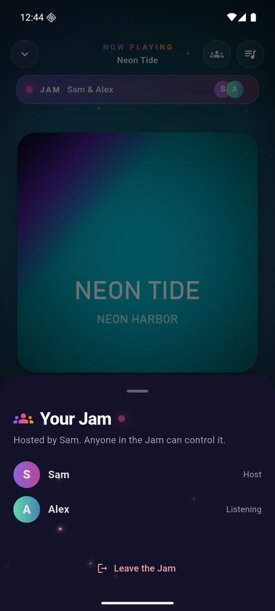<br>Who's listening |

### Better artist bios: Wikipedia contact

Artist bios come from Wikipedia, which allows apps that don't say who they are only **10
requests a minute**. Wikimedia's [User-Agent policy](https://foundation.wikimedia.org/wiki/Policy:Wikimedia_Foundation_User-Agent_Policy)
asks apps to include a way to contact them, and then allows 200 a minute.

<p align="center">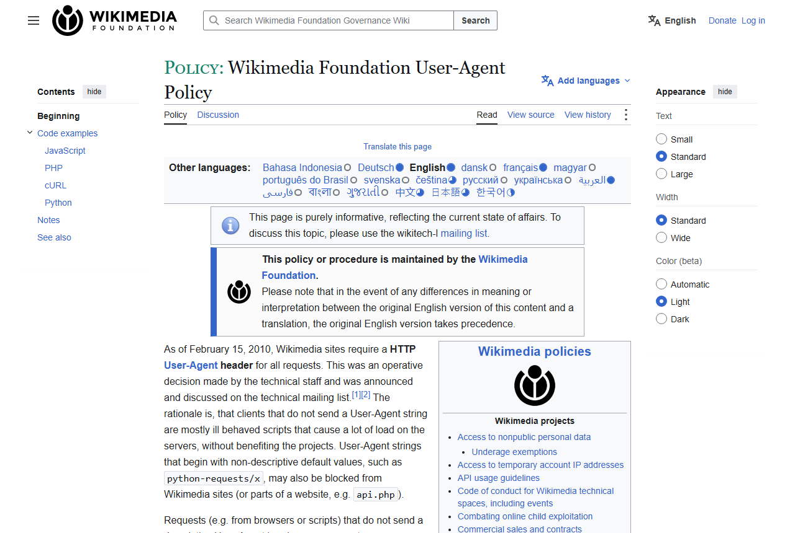</p>

Put your email address or website into **Settings → App access → Wikipedia contact** (see the
[App access screenshot](#option-a-your-own-domain-with-cloudflare-tunnel)). It's only sent to
Wikipedia, with bio requests. Bios work without it; they just fill in more slowly the first time.

### More artist bios: Last.fm API key

For artists without a Wikipedia article, Songarr can use Last.fm's bios. The key is free.

<p align="center">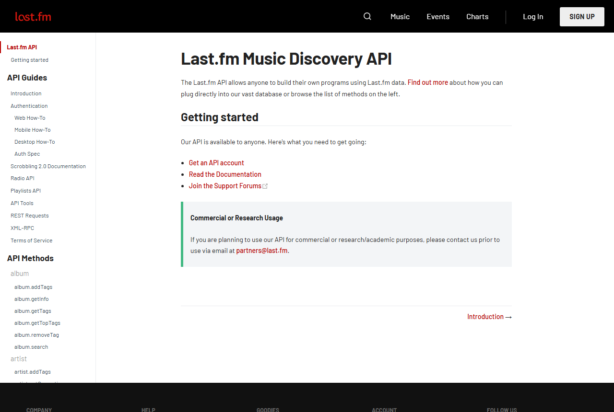<br>
<sub><a href="https://www.last.fm/api">last.fm/api</a> → <b>Get an API account</b></sub></p>

<p align="center">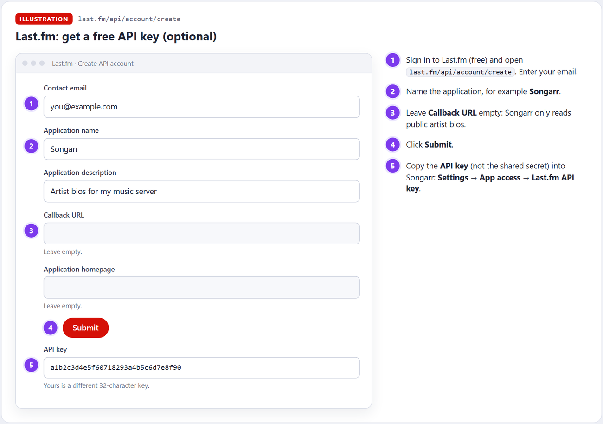</p>

Paste the **API key** into **Settings → App access → Last.fm API key**.

### YouTube sign-in ("Sign in to confirm you're not a bot")

Without signing in, YouTube allows roughly 300 downloads an hour, and Songarr stays under that
on its own. Signing in unlocks age-restricted songs, a much higher limit (about 2,000 an hour)
and 256 kbps audio with YouTube Premium.

<p align="center">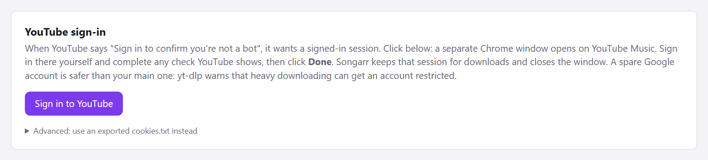</p>

**Settings → YouTube sign-in → Sign in to YouTube** opens a separate Chrome window with its own
profile (your normal Chrome profile is never touched). Sign in there and click **Done**. Use a
**spare Google account**: yt-dlp warns that heavy downloading can get an account restricted. An
exported `cookies.txt` also works (under **Advanced**).

### Family members

Each person gets their own likes, playlists, history and recommendations; songs are downloaded
once and shared.

<p align="center">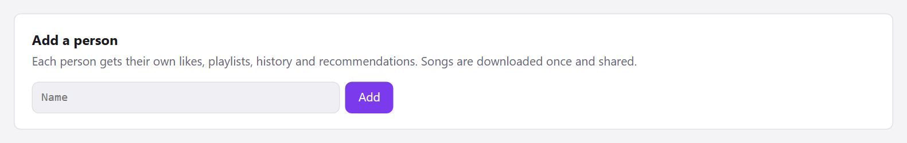</p>

1. In Songarr: **People → Add a person**.
2. Bring their music over: **Import from Exportify…** on their profile ([Step 2](#step-2-bring-your-music-over)).
3. Pair their phone ([Step 5](#step-5-sign-in-on-each-phone)).

### Start automatically when you log in

Run this once in PowerShell **from the Songarr folder**. It creates a scheduled task, which you
can see or remove in Task Scheduler:

```powershell
$dir = (Get-Location).Path
$a = New-ScheduledTaskAction -Execute "$dir\.venv\Scripts\pythonw.exe" -Argument "-m songarr" -WorkingDirectory $dir
Register-ScheduledTask -TaskName "Songarr" -Action $a -Trigger (New-ScheduledTaskTrigger -AtLogOn -User $env:USERNAME) -Settings (New-ScheduledTaskSettingsSet -ExecutionTimeLimit ([TimeSpan]::Zero) -AllowStartIfOnBatteries -DontStopIfGoingOnBatteries)
```

---

## Using Songarr

### The admin website

| Page | What it's for |
| --- | --- |
| **Library** | Every song and its status. Search, filter, retry, ignore, **Delete file**. |
| **Activity** | What's downloading right now, the pace, and recent events. |
| **Wanted** | Songs waiting, failed, or needing you to pick the right YouTube upload. |
| **Playlists** | Everyone's Liked Songs and playlists, and how much of each is downloaded. |
| **People** | Family profiles, importing their music from Exportify, signed-in phones, pairing and passwords. |
| **Settings** | Everything configurable. |

<p align="center">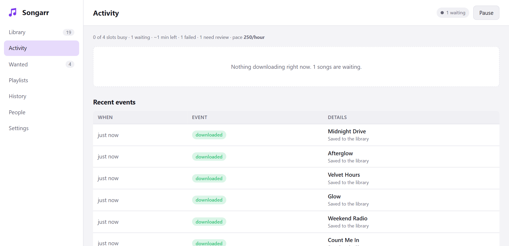</p>
<p align="center">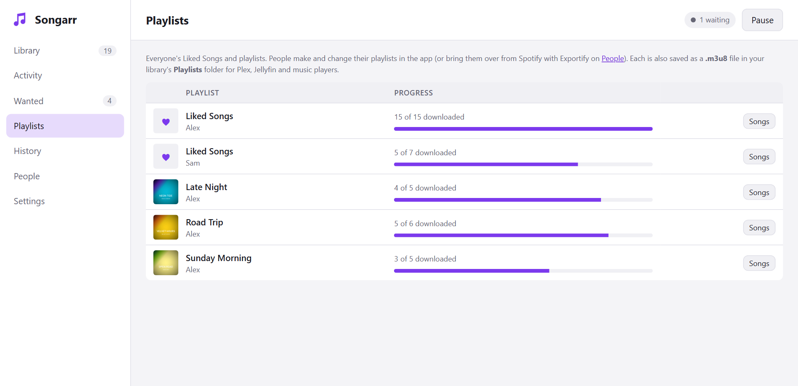</p>

**Song statuses**

| Status | Meaning |
| --- | --- |
| Wanted | Waiting for a download slot. App requests go first (newest first), then the backlog (newest like first). |
| Searching / Downloading | In progress. |
| Downloaded | In your library, tagged, with cover art. |
| Needs review | No upload matched confidently. Pick one under **Wanted → Needs review** (each links to YouTube so you can listen first), or paste your own link. |
| Failed | Retried automatically after 1 h, 6 h, 1 day, then 3 days, or right away with **Retry**. |
| Ignored | Never downloaded until you **Unignore** it. |
| Not wanted | Nobody likes it, has it in a playlist or asked for it any more. Songarr stops tracking it, but the file is kept. |

**Deleting a song's file:** **Delete file** asks whether to just delete it (it's then marked
Ignored so it isn't downloaded straight back) or to **delete and redownload** a bad copy. Only
files inside the music folder can be deleted, and empty folders are tidied up. Songarr never
deletes song files on its own: when someone unlikes a song, it only leaves *their* library.

<p align="center">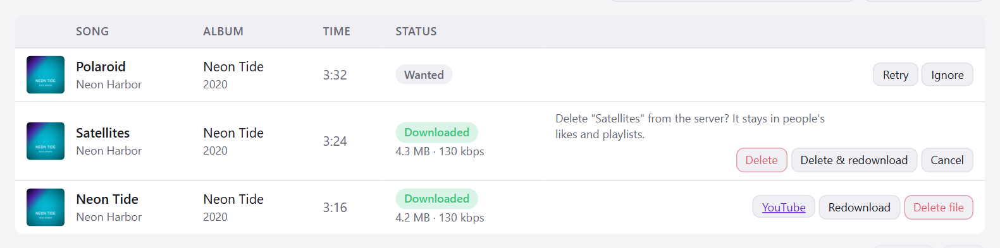</p>

### The app

| | | |
| :---: | :---: | :---: |
| 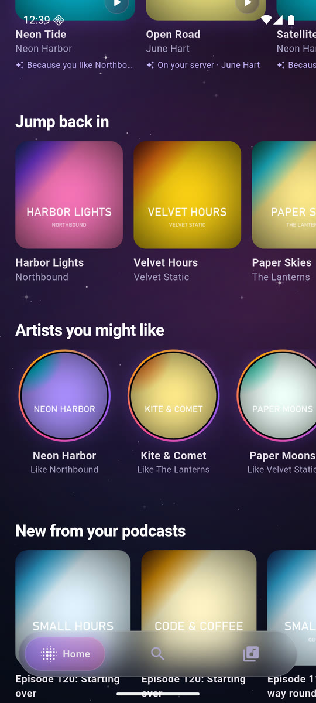<br>Artists and podcasts for you | 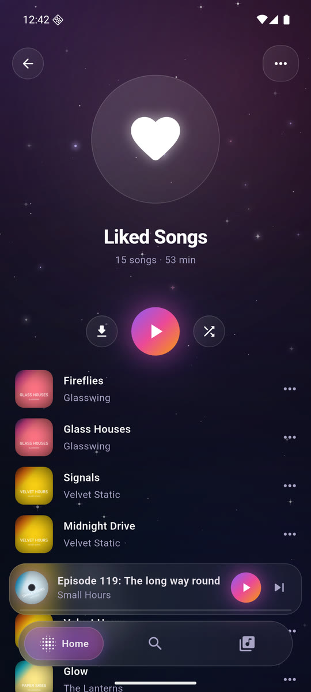<br>Liked Songs | 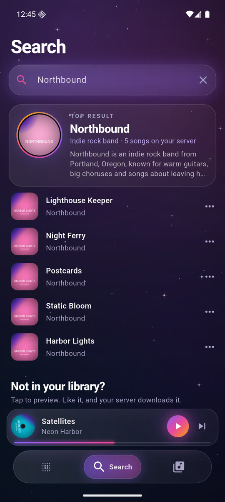<br>Search, with the artist first |
| 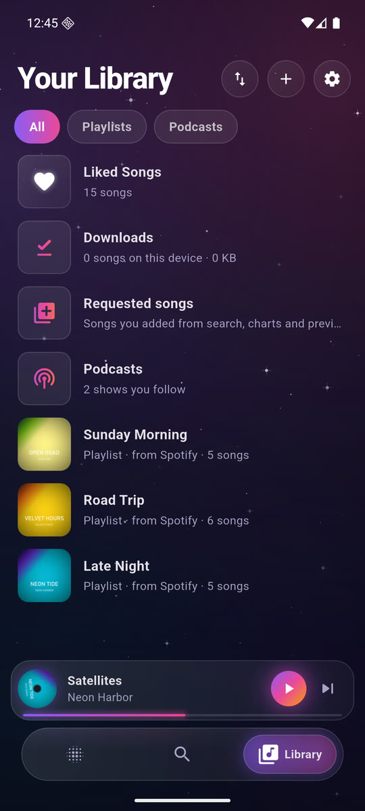<br>Your library | 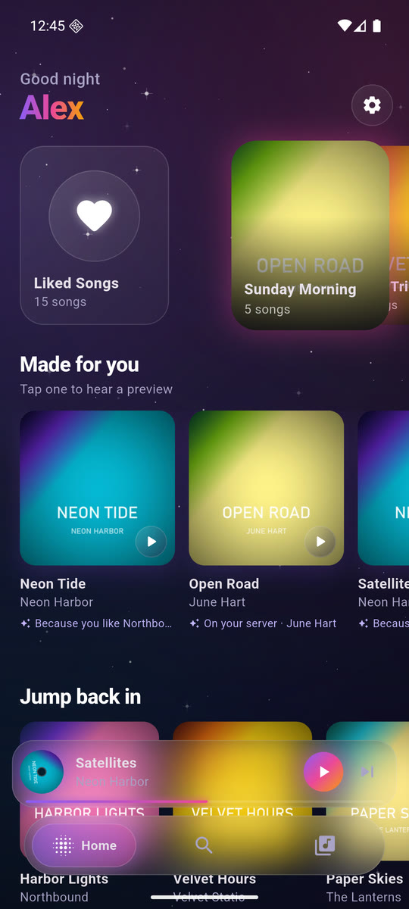<br>Press and hold to arrange | <br>Podcasts |

<p align="center">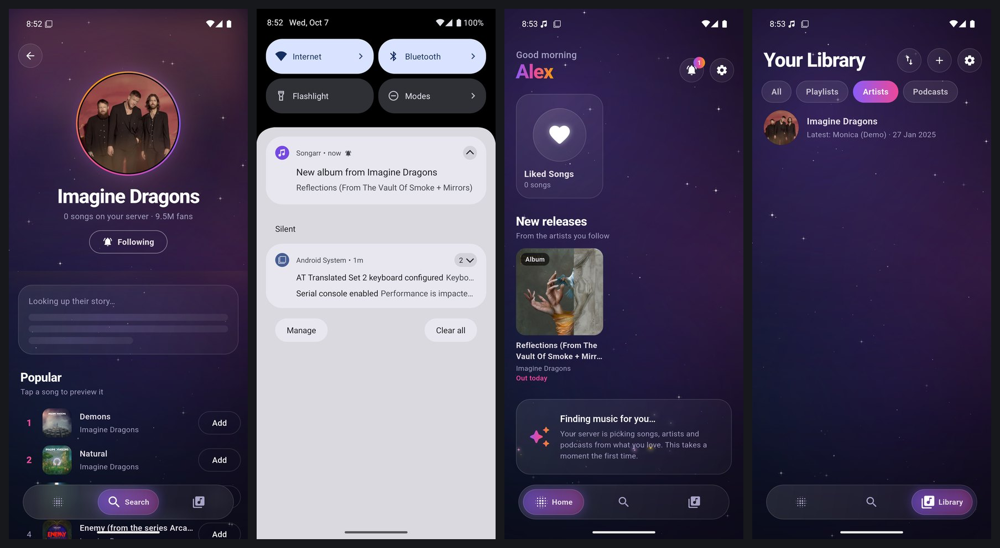</p>

- **Playlists are yours.** Each person makes their own and changes them freely: rename, reorder,
  add, remove or delete. Ones brought over from Spotify with Exportify are theirs the same way.
- **Arrange** playlists by pressing and holding one on Home, or with ⇅ in the Library.
  **Reorder songs** from a playlist's (or Liked Songs') ⋯ menu.
- **Previews:** tap a made-for-you song you don't have yet to hear 30 seconds; **Like** saves and
  downloads it. Search also finds songs that aren't on your server yet.
- **Whole albums:** search for any album (a soundtrack, a film score, a live album) and open it from
  the **Albums** row. It lists every track and marks the ones already on your server; **Add album**
  downloads the rest next, in album order.
- **Follow artists:** tap **Follow** on an artist's page. Their new releases show on Home under
  **New releases**, ring the **bell**, and (with [Firebase](#jam-notifications-firebase)) reach your
  phone; tapping one opens the album. **Library → Artists** lists who you follow.
- **Requests go first:** songs and albums you add from the app download before the backlog,
  the newest request first.
- **Podcasts** resume across devices. Downloads **expire**: per show choose **Off**, **Until
  played** or a number of days.
- **Now Playing:** tap the artist under the title to open their page (with several artists, pick one).
- **Jams:** in Now Playing tap the **people** button (or **Start a Jam with this** on a song) and
  pick who to invite. Everyone hears the same moment; anyone can play, pause, skip or add songs.
  The Jam plays on through the list it started from, and switches when someone picks another.
- **Recent searches** show when you open Search (kept on the phone, for each profile); tap one to
  search again, or ✕ to remove it.
- **Picks up where you left off:** after the app is closed, force-closed or updated, the song you were
  playing comes back, paused at the same spot.
- **Headphone button:** once to play or pause, twice for next, three times for previous.
- **Depth effect:** turn the phone and the stars shift by depth. Turn it off under **Settings →
  Look & feel**.
- **Downloads and cache:** download any playlist or album for offline use. Songs you stream are
  also cached (1–20 GB, default 2 GB); when it's full, the songs you listen to least go first.
  The next 3 songs of the queue are fetched ahead, so music keeps playing through a dead spot or
  a [backup server](#backup-servers) taking over.
- **Backup servers:** the app knows every server's address and switches to whichever answers,
  carrying on from the same song and spot.

## Following artists

Tap **Follow** on an artist's page in the app. A few times a day Songarr looks up the releases of
every followed artist (on Deezer). When one of them puts out something new (an album, EP or
single from the last two weeks):

- it shows on Home under **New releases**, with their other releases from the last two months;
- the **bell** on Home counts it, and lists it;
- phones get a notification (with [Firebase](#jam-notifications-firebase) set up), in its own
  **New releases** channel, quieter than Jam invites.

Tapping any of them opens the album, ready to add with **Add album**. The artists you follow are in
**Library → Artists**, each with their latest release. Following someone only remembers what they've
already released, so it doesn't set off a pile of notifications, and an old album turning up later
on Deezer isn't news either. Each person follows their own artists.

## Music you already have

Songarr doesn't download what's already in the music folder. When it starts, when the folder is
changed, once a day, and with **Settings → Downloads → Scan now**, it looks through the folder
(the first time reads every file's tags, which takes a few minutes for thousands of songs; after
that only new or changed files) and matches songs waiting to download to files there:

- files Songarr made before (they carry its tag for the song, for example from another PC),
- the same recording (ISRC), or
- the same title and artist with a length within 3 seconds (preferring the same album).

Files without tags are read from their names (`Artist\Album (Year)\01 - Title.ext`). Music from
anywhere else (M4A, MP3, FLAC, Ogg, Opus or WAV) is used where it is: never moved, renamed or
retagged. A file Songarr already keeps for another song (the same song on another album) is copied
into this song's own album folder instead, so every album folder stays complete. Downloads wait for
the first scan after starting, and each song is checked again just before it would be downloaded.

## Name and icon

**Settings → Name and icon** renames Songarr and gives it your own icon, everywhere at once:

- the admin website: its title, header and favicon;
- the apps: the name and icon inside them, and their messages;
- Windows: the icon by the clock and its notifications, and the desktop and Start-menu shortcuts
  (renamed, with the new icon).

Any picture works (PNG, JPEG, WebP, GIF, BMP, ICO or SVG). It's fitted into a square without being
cropped; 512 × 512 or bigger looks best, and a logo on a see-through background works well.
**Phone icon background** is the colour behind it on Android home screens.

<p align="center">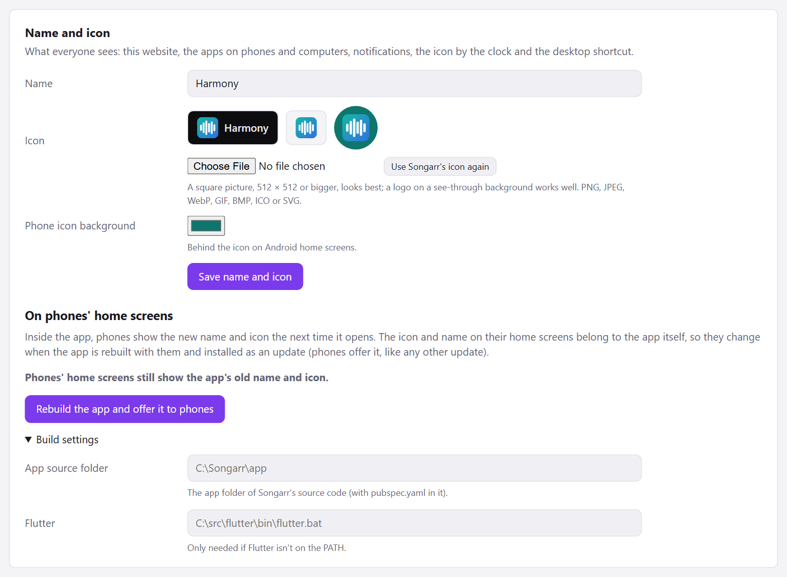</p>
<p align="center">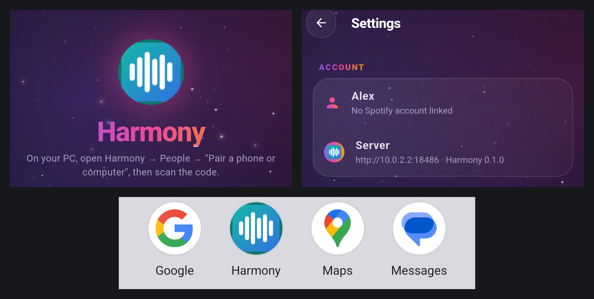</p>

Phones show the new name and icon inside the app the next time it opens. The icon and name on
their **home screens** are part of the app itself, so **Rebuild the app and offer it to phones**
builds the app with them and publishes it like any other [app update](#step-4-build-and-install-the-android-app); phones offer
it on their next check. Rebuilding needs Flutter on this PC, the app's source folder and the
signing key the phones' app was made with (the same things as building it in the first place); the
page says what's missing, and **Build settings** points it at another source folder or Flutter.
**Use Songarr's icon again** goes back.

From the command line (the Windows installer uses this):

```bash
.venv\Scripts\python.exe -m songarr --brand-name "Family Tunes" --brand-icon logo.png
```

## Keeping it working

**Songarr updates itself.** When it runs from a git clone (as in [Step 1](#step-1-install-the-server), or
on Ubuntu), every update check also looks for new commits on GitHub. It moves to them, installs the
packages again if `requirements.txt` changed, checks the new code starts, and restarts once nobody's
listening. A folder with changes of its own is never overwritten (Songarr only says an update is
waiting), and a version that doesn't start is put back. **Settings → System** shows the commit it's on,
and **Settings → Servers** the commit each server runs. The Windows installer's copy isn't a git clone:
it's updated by installing a newer installer over it.

YouTube changes often, and yt-dlp keeps up with frequent releases. Songarr keeps [yt-dlp](https://github.com/yt-dlp/yt-dlp) and its other Python packages up to
date by itself (**Settings → System → Automatic updates**, on by default). Every few hours it looks for
new stable releases on PyPI:

- **yt-dlp and ytmusicapi** (they talk to YouTube): every new stable release.
- **the other packages**: new stable releases within the same major version, so an incompatible change
  never arrives unattended.
- never pre-releases or withdrawn releases, and only releases at least two hours old.

It installs them into its own environment, checks they load, and then restarts itself once nobody's
listening (no Jam on, no app activity for 10 minutes, downloads in progress finished). If an update
doesn't load, the previous version is put back and that release isn't tried again. Updates are listed
in History. **Check for updates now** checks straight away.

To update by hand (for example with automatic updates switched off), run this and restart Songarr:

<p align="center">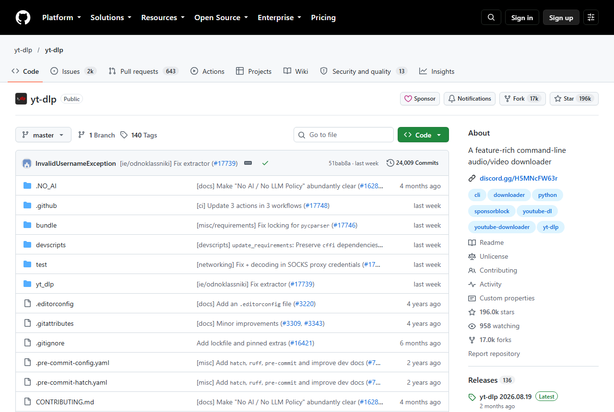</p>
<p align="center">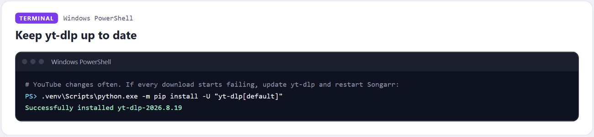</p>

```powershell
.venv\Scripts\python.exe -m pip install -U "yt-dlp[default]"
```

To update Songarr itself by hand (with automatic updates switched off): `git pull`, then
`.venv\Scripts\python.exe -m pip install -r requirements.txt`, and restart it. When the app changed,
rebuild and publish it too ([Step 4](#step-4-build-and-install-the-android-app)).

## Backup servers

Run a second Songarr server (an Ubuntu box, another PC) as a backup. Both use the music on your
NAS. One server is **active** at a time: it downloads and serves the phones. The other
**stands by**. If the active one stops for any reason (crash, power cut, reboot, a dead disk), the
other takes over by itself within about a minute, and phones switch to it on their own.

How it works:

- The servers share a folder on the NAS. The active server writes a heartbeat there every 5 seconds,
  and a copy of everything every 2 minutes (when something changed): the database (profiles,
  devices, likes, playlists, plays), the YouTube sign-in, the Firebase key, the name and icon, and the
  app updates.
- When the heartbeat stops for 45 seconds, the backup loads the latest copy and takes over. Its
  music folder can be a different path to the same files (`\\nas\music` on Windows,
  `/mnt/nas/Music` on Ubuntu): every path is translated. At most the last 2 minutes of changes are
  lost in a crash. Stopping a server on purpose (**Stop** by the clock or in System, `systemctl
  stop`) hands over first, so nothing is lost and the backup takes over within seconds. A restart
  (after an update) is over before the backup would step in, so the server simply carries on.
- When the main server is back, it takes over again once things are quiet: after the backup has
  been active for at least 10 minutes and nobody is listening (no Jam, no app activity for 10
  minutes), and within 6 hours at the latest. **Make active** picks the active server yourself;
  the one you pick stays active until you choose otherwise.
- A backup never starts things off: until the main server has been turned on and shared a copy, it
  waits. The first time a server takes in the shared copy, its own database is kept beside it, as
  `songarr-before-joining.db` in its data folder.
- **One admin page.** Every server's admin website shows the same thing: a standby passes everything
  to the active server. **Settings → Servers** lists each server (active, standing by or away), with
  **Make active**, **Check for updates**, **Restart** and **Its folders…** (each server's own music
  folder, podcast folder, FFmpeg and app address).
- **Phones** learn every server's app address, and switch to whichever answers when theirs doesn't.
  They keep the next 3 songs of the queue on the phone (and the one playing), so music carries on
  through a takeover; if no server answers at all, playback picks up again by itself once one does.

### Set it up

1. **The main server** (your Windows PC): **Settings → Servers**, type the shared folder as that PC reaches it
   (e.g. `\\nas\share\Songarr servers`; a full `\\nas\...` path works even when no one is signed in,
   unlike a mapped drive letter), keep *the main server*, and **Turn on**. Songarr restarts.
2. **An app address for the backup.** Each server needs its own: a Cloudflare Tunnel runs on one
   machine, so give the backup its own tunnel and hostname (e.g. `music2.yourdomain.com` →
   `localhost:8486`, made the same way as in [App access](#option-a-your-own-domain-with-cloudflare-tunnel)). On Ubuntu,
   install the connector from [Cloudflare's package repository](https://pkg.cloudflare.com/) and run
   the `cloudflared service install <token>` command the dashboard shows, with `sudo`.
3. **Mount the NAS on Ubuntu**, so the music and the shared folder are files there. For an SMB share:

   ```bash
   sudo apt install cifs-utils
   sudo mkdir -p /mnt/nas
   printf 'username=NAS-USER\npassword=NAS-PASSWORD\n' | sudo tee /root/.nas-credentials >/dev/null
   sudo chmod 600 /root/.nas-credentials
   echo "//nas/share /mnt/nas cifs credentials=/root/.nas-credentials,uid=$(id -u),gid=$(id -g),iocharset=utf8,_netdev,nofail 0 0" | sudo tee -a /etc/fstab
   sudo mount -a
   ```

   (Fill in the NAS's user and password with an editor rather than in the command, so they don't
   stay in your shell history.)
4. **Install the backup** on the Ubuntu box: clone this repository (so it updates itself from GitHub,
   like the main server) and run the install script:

   ```bash
   sudo apt install -y git && git clone https://github.com/ApexusNULL/Songarr.git ~/songarr && cd ~/songarr
   installer/install-linux.sh --music-folder /mnt/nas/Music --cluster-folder "/mnt/nas/Songarr servers" --name "Ubuntu box" --role backup --app-address https://music2.yourdomain.com
   ```

   It installs Python, FFmpeg and Deno, sets Songarr up in `.venv` with its data in
   `/var/lib/songarr`, and runs it as a systemd service (`songarr`) that starts with the machine.
   Songarr needs Python 3.12 or newer: Ubuntu 24.04 or later, or Debian 13. Logs:
   `journalctl -u songarr` and `/var/lib/songarr/logs/songarr.log`.

A Windows backup works the same way: install it with the [Windows installer](#the-windows-installer)
and turn it on in its **Settings → Servers**, choosing *a backup*.

The servers must run the same Songarr version (each keeps its packages up to date by itself). Only the
active server downloads, so the NAS sees no double downloads. If the NAS itself goes away, so does the
music, and neither server can help with that.

## Settings reference

| Setting | Default | Notes |
| --- | --- | --- |
| Library folder | `Music\Songarr` in your user folder | Any local folder or network share. Music already there isn't downloaded again ([Music you already have](#music-you-already-have)). |
| Format | M4A | YouTube's own AAC, not re-encoded. Opus also isn't re-encoded. MP3 is re-encoded. |
| Max songs per hour | 250 | Stays under YouTube's ~300/hour guest limit. Raise it only if signed in. |
| Parallel downloads | 4 | Up to 8. Requests are still spaced to the hourly limit. |
| Match strictness | 0.70 | Lower downloads more automatically; higher sends more to review. |
| Playlist files | On | Write everyone's Liked Songs and playlists as `.m3u8` files to `<library>\Playlists`. |
| App address | (none) | Your HTTPS address from Step 3, put into pairing QR codes. |
| Wikipedia contact / Last.fm API key | (none) | Optional, see [Optional extras](#optional-extras). |
| Automatic updates | On | Keeps Songarr itself (from GitHub, in a git clone), yt-dlp and the other packages current; see [Keeping it working](#keeping-it-working). |
| Name and icon | Songarr | What the website, apps, tray icon and shortcuts are called and look like; see [Name and icon](#name-and-icon). |

## Where things live

| What | Where |
| --- | --- |
| Program | Wherever you cloned it (Python environment in `.venv`) |
| Database, logs, temp files | `%PROGRAMDATA%\Songarr` (change with `--data`) |
| Log file | `%PROGRAMDATA%\Songarr\logs\songarr.log` |
| YouTube sign-in | `%PROGRAMDATA%\Songarr\youtube-cookies.txt` and the `youtube-browser` profile |
| Firebase key (optional) | `%PROGRAMDATA%\Songarr\firebase-service-account.json` |
| App updates | `%PROGRAMDATA%\Songarr\app-updates` |
| Music | Your library folder |
| Podcast downloads | A `Podcasts` folder next to the library (deleted automatically) |

## Security and privacy

- The **admin website** listens only on `127.0.0.1` and rejects requests from other websites
  and DNS-rebinding tricks. Don't expose it.
- The **app API** listens on `127.0.0.1` by default; your tunnel connects to it locally.
- Device tokens and pairing codes are stored only as **SHA-256 hashes**. Passwords use
  **scrypt**, and wrong guesses are limited (5 per name and 10 per address per 10 minutes).
- Songarr never signs in to Spotify: people bring their libraries over with an Exportify file.
- Everything personal stays on your machine, never in this repository: the database, YouTube
  cookies, the Firebase key, your signing key and `google-services.json`. The `.gitignore` keeps
  them out; check `git status` before every commit anyway.

## Troubleshooting

| Problem | Fix |
| --- | --- |
| Every download fails | Usually fixed by a yt-dlp update, which Songarr installs by itself within a few hours of its release ([Keeping it working](#keeping-it-working)). Click **Check for updates now** to get it sooner. |
| "Sign in to confirm you're not a bot" | Use [YouTube sign-in](#youtube-sign-in-sign-in-to-confirm-youre-not-a-bot), or wait: Songarr pauses and resumes on its own. |
| Downloads fail with a JavaScript error | Install Node.js 22+ (or Deno) and restart Songarr. |
| "Rebuild the app" says Flutter or the app's source is missing | Install Flutter as in [Step 4](#step-4-build-and-install-the-android-app), or set the paths under **Build settings**. Without them, phones still show the new name and icon inside the app. |
| No Songarr icon by the clock | Click **^** (Show hidden icons) on the taskbar: Windows puts new icons there. Drag it onto the taskbar to keep it in view. |
| `python`, `git` or `winget` not found | Close and reopen PowerShell after installing. If `python` opens the Microsoft Store, turn off its *App execution alias* in Windows Settings → Apps → Advanced app settings. |
| An import says "That doesn't look like an Exportify export" | Export again with Exportify set to English (Songarr reads its English column names), and import the .csv or the **Export All** .zip as it is. |
| A playlist didn't come over | Exportify only lists playlists in the person's Spotify library; ones they only follow may need **Follow** in Spotify first. |
| The phone can't reach the server | Open your app address in a browser: a **404** means the tunnel works (check the address in **Settings → App access**); an error page means the tunnel isn't pointing at `localhost:8486`, or `cloudflared` isn't running (Windows Services → *Cloudflared agent*). |
| The domain isn't working yet | New nameservers can take up to a day; Cloudflare shows the domain as **Active** when ready. |
| The app won't install an update | It was built with a different signing key. Keep using the same `key.properties` and `.jks`, or uninstall and reinstall. |
| No media controls or notification | Allow notifications for Songarr in Android settings. |
| No new-release notifications | They come with Jam notifications: set up [Firebase](#jam-notifications-firebase). Without it, new releases still show on Home and under the bell. |
| No Jam notifications | Set up [Firebase](#jam-notifications-firebase), rebuild the app, restart the server, and open the app once on each phone. |
| Testing on the Android emulator | The emulator reaches your PC as `http://10.0.2.2:8486`; plain HTTP is allowed only for that address. |

## Development

### The Windows installer

The wizard asks for:

- **where to install** it (for just you, or for everyone on the PC);
- **name and logo**: what the server, the app, the shortcuts and the icon by the clock are called
  and look like (the same as Settings → Name and icon, which can change them later);
- **folders**: the music folder (music already there is found and used, not downloaded again) and
  the data folder (database, settings, logs);
- **network (advanced)**: the admin website and app ports, and whether phones on the home network
  may connect straight to this PC;
- **shortcuts and starting**: desktop and Start-menu shortcuts, and starting with Windows;
- **FFmpeg and Deno**, if they're missing: installed with winget.

It carries its own Python with every package Songarr needs, so nothing else has to be installed
first; Songarr keeps yt-dlp inside it up to date by itself. A newer Songarr comes with a newer
installer (it isn't a git clone, so it doesn't update itself from GitHub). Installing again over an existing
install stops Songarr, keeps all its settings, and only changes what you change in the wizard.
Uninstalling (Windows Settings → Apps) stops Songarr, removes its shortcuts, and asks whether to
delete the data folder too; the music folder is always kept.

Unattended installs take the wizard's answers on the command line:

```bash
Songarr-Setup-0.1.0.exe /VERYSILENT /TASKS="desktopicon,startmenu,autostart" /NAME="Family Tunes" /LOGO="C:\logo.png" /MUSICDIR="D:\Music" /PORT=8484 /APPPORT=8486
```

### Building the installer

Build it with:

```bash
.venv\Scripts\python.exe installer\build.py
```

It needs [Inno Setup 6](https://jrsoftware.org/isinfo.php) (`winget install JRSoftware.InnoSetup`)
and writes `dist\Songarr-Setup-<version>.exe`. The bundled Python is a copy of the one the virtual
environment was made from (without its tests and Tk) plus the environment's packages; it's checked
before packing. The installer isn't code-signed, so Windows SmartScreen may say it's from an
unknown publisher (**More info → Run anyway**).

### Tests

```powershell
# server: fully offline, against fake YouTube, Deezer, podcast and Chrome servers
.venv\Scripts\python.exe -m unittest discover -s tests -t .

# app
cd app
flutter analyze
flutter test
```

The app's **contract test** runs the real API client against a throwaway server with fake
data. Start it with `.venv\Scripts\python.exe -m tests.contract_server`, then run
`app/test/api_contract_test.dart` with `SONGARR_TEST_SERVER` and `SONGARR_TEST_CODE` set to the
address and code it prints.

### Code map

```
songarr/                  the server
  __main__.py             start-up, ports, logging
  service.py              paced parallel download workers, retries, cooldowns
  youtube.py              YouTube Music search (ytmusicapi), yt-dlp downloads, throttling detection
  matching.py             scores YouTube uploads against a song
  tagging.py              M4A / MP3 / Opus tags and cover art (mutagen)
  library.py              Artist/Album (Year)/NN - Title paths, Windows-safe names
  playlists.py            .m3u8 files of everyone's Liked Songs and playlists
  db.py                   SQLite schema, migrations and settings
  users.py                family profiles, devices, pairing codes, passwords
  appapi.py               the app API (see docs/API.md)
  jams.py / push.py       Jams (shared timelines) and Firebase notifications
  recommend.py            made-for-you songs, artists and podcasts
  discover.py             charts, catalogue search, previews (Deezer public API)
  podcasts.py             Apple Podcasts directory, RSS feeds, safe outside fetches
  podcast_downloads.py    podcast downloads that expire
  artist_info.py          bios and history (Wikipedia, Wikidata, Last.fm)
  lyrics.py               synced lyrics (LRCLIB)
  app_updates.py          publishes Android builds for phones to install
  dependencies.py         keeps yt-dlp and the other packages up to date, restarts when idle
  selfupdate.py           Songarr updates itself from its git repository (GitHub)
  verify.py               YouTube sign-in window and cookie handover (Chrome DevTools)
  tray.py                 the icon by the clock and its menu (ctypes, Windows only)
  scan.py                 finds music already in the music folder so it isn't downloaded again
  releases.py             following artists, their new releases and the bell's notifications
  exportify.py            People → Import from Exportify: a person's likes and playlists from a file
  download_page.py        <app address>/download: the app, with pictures of each install step (assets/download)
  cluster.py              backup servers: the heartbeat and takeover, copies on the NAS, one admin page for all
  branding.py             Settings → Name and icon: one picture made into every icon (Pillow)
  app_build.py            rebuilds the Android app with the name and icon, then publishes it
  shortcut.py             --shortcut: the desktop shortcut, with assets/songarr.ico
  web.py / ui.html        the admin website
installer/                build.py and songarr.iss: the Windows installer; install-linux.sh: Ubuntu/Debian with systemd
tests/                    server tests (offline fakes)
app/                      the Flutter app (see app/README.md)
docs/API.md               the app API contract
docs/images/              screenshots for this guide (demo data only)
```

## Legal and fair use

Songarr is a personal project, shared for learning and for personal use. It downloads audio
from YouTube with yt-dlp, which may be against YouTube's Terms of Service, and the music you
download is protected by copyright. **You are responsible for how you use it.** Only download
music you have the right to, keep your server and library private to your household, and
respect the terms of Spotify, YouTube and the other services it uses. Songarr is not affiliated
with Spotify, YouTube, Google, Firebase, Cloudflare, Tailscale, Deezer, Apple, Wikipedia,
Last.fm or LRCLIB. Screenshots of third-party websites are shown for illustration and may look
different today; the drawn "Illustration" cards show what to fill in, not the exact pages.

## License

MIT: see [LICENSE](LICENSE).
